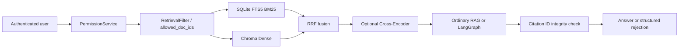

# Architecture

## 请求链路



权限条件不是召回后的清理步骤。`PermissionService` 先计算当前用户可访问的文档 ID，`RetrievalFilter` 同时传给 SQLite FTS5 SQL 和 Chroma `where`。第三方旧 VectorStore adapter 不支持 filter 时，兼容路径才会在 adapter 返回后过滤；内置生产 adapter 使用前置过滤。

## 摄取链路

```text
POST /ingestion/text
  -> 保存 payload + Document + IngestionTask(pending)
  -> 返回 202/task_id
  -> BackgroundTask（开发）或 ARQ/Redis（部署）
  -> parsing -> chunking -> indexing
  -> embedding/Chroma + SQLite FTS5
  -> completed / failed
```

内容 SHA-256 与确定性自动 `doc_id` 防止重复任务。Chunk ID 由分块器确定，Dense 和 BM25 都采用 upsert；worker 重试不会增加重复索引。删除文档同时清理 Chroma 与 BM25。上传文件落在 `INGESTION_STORAGE_DIR`，密钥只从环境读取。

## LangGraph 状态与停止条件

State 只有业务数据：original/current query、messages、filters、attempts、检索/相关文档、answer、citations、groundedness 和 failure reason。LLM 与 retrieval service 由构造函数注入，不进入 State。

`classify -> rewrite -> retrieve -> grade` 后，有证据才生成；无证据且 attempts 小于上限才回到 rewrite。回答引用集合必须是 relevant chunk ID 的子集，否则最多重试到 `AGENTIC_MAX_RETRIEVAL_ATTEMPTS`，之后进入 reject。默认上限 2，配置校验不允许超过 3。这里的 `groundedness_result` 仅检查引用 ID 是否属于本次证据集合，不判断每个自然语言事实是否被证据蕴含；项目不能据此声称实现了完整 Faithfulness/Groundedness Judge。

## 降级策略

- 没有 API key：`LLM_PROVIDER=local` 与 `EMBEDDING_PROVIDER=local` 保证核心链路运行。
- `LLM_PROVIDER=qwen` 通过 DashScope OpenAI-compatible endpoint 使用通义千问；密钥只从 `DASHSCOPE_API_KEY` 读取，和 Embedding Provider 独立切换。
- BM25 或 Dense 可分别关闭；至少一路开启时检索正常。
- Reranker 可选本地 Cross-Encoder 或 Cohere；本地 ML 依赖通过 `local-ml` Extra 安装，默认 Docker/uv 安装不包含 Torch/CUDA。未配置时关闭，运行失败且 `RERANKER_FAIL_OPEN=true` 时返回 RRF 候选并记录原因。
- OpenAI LLM/Embedding 显式配置请求超时和 SDK 最大重试；Reranker 有超时且检索服务至多尝试两次。
- 语义缓存异常不阻断生成；权限缓存指纹包括 user、allowed docs、space、filter、model、prompt 与 pipeline version。
- 普通 `/agent/ask` 保留为 LangGraph 故障时的降级路径。

## 已知边界

- SQLite FTS5 适合单机、CI、英文错误码和英文技术文档；默认 tokenizer 对中文检索不理想。中文生产场景应实现现有 `KeywordIndex` 接口的 OpenSearch/Elasticsearch 中文分词 adapter。
- 本地 hash embedding 只用于无密钥开发与确定性链路验证，不具备可宣称的同义表达/语义泛化能力。语义质量验收必须改用真实 Embedding 模型并重建索引。
- `/ingestion/text` 与 `/ingestion/pdf` 都通过同一任务/worker 状态机处理。
- 普通 RAG 在 pgvector 原有分区字段中写入权限指纹；指纹包含当前用户、文档范围、知识空间、filter、模型、prompt 与 pipeline version。多文档 Agentic 路径当前不缓存。
- ARQ 自动失败最多执行 `INGESTION_MAX_RETRIES + 1` 次；人工 retry 使用新的 Redis job ID，避免被 ARQ 的已完成 job 去重键吞掉，同时两路索引仍按确定性 Chunk ID upsert。
